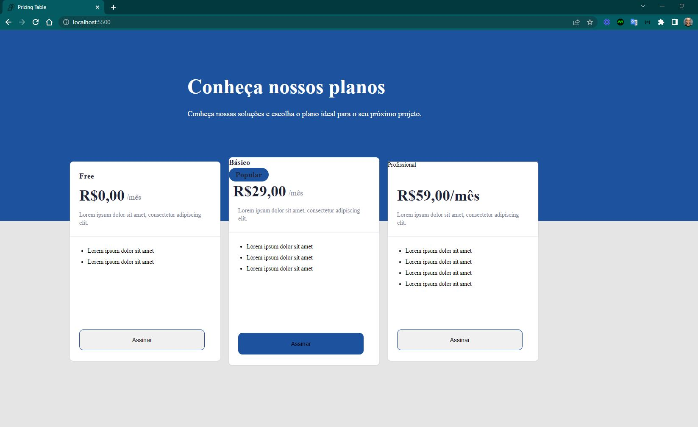
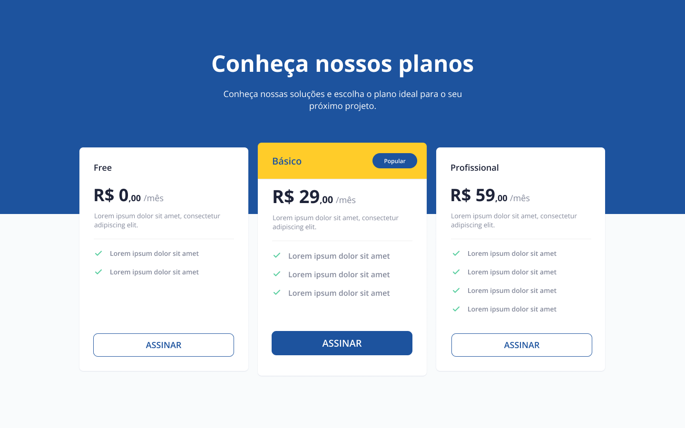

<h4 align="center"> 
	🚧 Pricing Table 🚀
</h4>

<p align="center" style="display: flex; align-items: flex-start; justify-content: center;">
  
</p>  

### 💻 Sobre o desafio

Neste desafio você vai desenvolver uma página com uma tabela com as opções de preços/planos do produto/serviço.


#### 💻 Techs

- Nível de dificuldade: Iniciante
- Tecnologias: html, css

#### 💻 Como começar?

1 - Use o link do [Figma](https://www.figma.com/file/2EiRU7P9HpD0S1Rkd6x9Vd/DD-%2F-Pricing-Table-(Copy)?node-id=3%3A2) como base para o projeto. Também disponibilizamos para download todos os assets necessários (imagens e ícones), para fazer o download basta clicar no link acima.  

2 - Leia com atenção todas as instruções do desafio.

3 - Bora codar! Lembre-se que você pode usar as tecnologias que se sentir mais confortável, mas também pode se desafiar usando novas techs, fazendo modificações e/ou adicionando funcionalidades no projeto como preferir. 🚀

4 - Compartilhe seu resultado ou tire suas dúvidas na nossa [**comunidade aberta**](https://discord.gg/bacwY2gDCF)

### 💡 Conteúdos Aplicados


#### 💡 [Guia Estelar de HTML](https://app.rocketseat.com.br/discover/course/o-guia-estelar-de-html)
O conteúdo esclarece plugin de preview HTML, tags, atributos, semântica, listas, abreviações, listas, representação de código, URLs, diretórios, tabelas, THead, TBody, colgroup, cabeçalho, meta, favicon, meta SEO e meta social.

#### 💡 [Guia Estelar de CSS](https://app.rocketseat.com.br/discover/course/o-guia-estelar-de-css)
O conteúdo aborda anatomia, seletores, box model, cascata, especificidade, shorthand, funções, devTools e vender prefixes.

#### 💡 [Posicionamento foguetes](https://app.rocketseat.com.br/discover/course/posicionando-foguetes)
Conhecer como o CSS trabalha com layout ou o posicionamento dos elementos na sua página, é essencial.

#### 💡 [Formulários de outro planeta](https://app.rocketseat.com.br/discover/course/formularios-de-outro-planeta)
A tag form no HTML é a maneira mais tradicional de interagir com o usuário da aplicação e é incrível o que é possível com esse elemento.

#### 💡 [Alinhando os planetas](https://app.rocketseat.com.br/node/flexbox)
Com o CSS moderno, nós podemos poscionar, alinhar, ordenar e trabalhar com os elelmentos de maneira flexível. Esse e outros poderes do Flexbox você vai conhecer agora.

#### 💡 [App bonito, até nos textos](https://app.rocketseat.com.br/node/flexbox)
Não adianta a aplicação estar linda, mas usando Comic Sans como fonte e, por isso, vamos aprender sobre tipografia na web com css.

### 🚀 [Requisitos do projeto](https://efficient-sloth-d85.notion.site/Desafio-Pricing-Table-e0b6f59253e54d229fdde09228226b32)

#### 🚀 Requisitos para o desafio 

- [ ] Seguir o layout do Figma.

#### 🚀 Requisitos bônus 

- [ ] Deixando o Layout responsivo
 
### 🎨 Style Guide

#### 🎨 Cores

- Templates de referências para ser feito

<p align="center" style="display: flex; align-items: flex-start; justify-content: center;">
  
</p>  

````css
:root {
  --yellow: #ffcc29;
  --blue: #1d539e;
  --gray: #828799;
  --page-background: #f9fbfc;
}
````

#### 🎨 Fontes

- [ ] font-family: Open Sans
- [ ] font Weight: 400, 600 e 700
- [ ] Você pode encontrar a fonte no [Google Fonts](https://fonts.google.com/)

### 📅 Entrega

Após concluí-los, adicionar esses códigos ao seu Github é uma boa forma de demonstrar seus conhecimentos para oportunidades futuras.

#### 📅 Tarefas

- [ ] Organizando os detalhes do projeto no readme.md
- [ ] Uma branch main e uma developer
- [ ] Favicon
- [ ] [Learn Responsive Design](https://web.dev/learn/design/)
- [ ] [Learn CSS](https://web.dev/learn/css/)
- [ ] divisor
- [ ] posição do header

#### 📅 Telas

- Desktop

<p align="center" style="display: flex; align-items: flex-start; justify-content: center;">
  
</p>  

Feito com ❤️ por Douglas A B Novato. 👋🏽 [Entre em contato!](https://www.linkedin.com/in/douglasabnovato/)
 
Fonte do projeto na [Rocketseat](https://www.rocketseat.com.br/). 👋 Participe da [comunidade aberta](https://discord.gg/bacwY2gDCF)!
